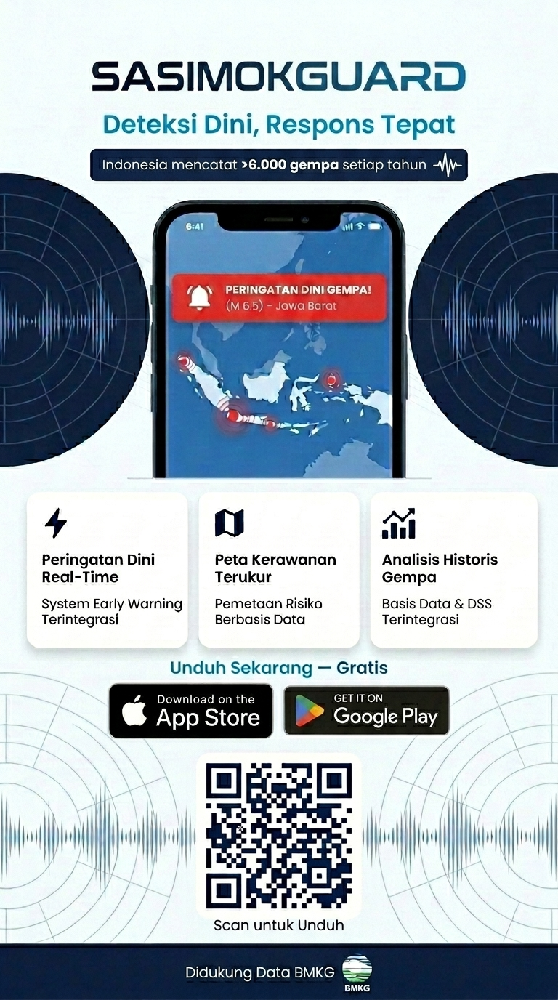

# 🌍 SeismoGuard — End-to-End Seismic Data Warehouse & Early Warning System

> **Platform Data Warehouse dan Sistem Peringatan Dini Gempa Bumi berbasis Medallion Architecture**  
> Mengintegrasikan data historis BMKG/Kaggle dengan pipeline real-time multi-sumber (BMKG, USGS, EMSC) untuk mendukung Business Intelligence, Sistem Pendukung Keputusan (DSS) Mitigasi Bencana, dan Early Warning System otomatis berbasis Indonesia.

---

## 📌 Deskripsi Proyek

**SeismoGuard** adalah proyek Data Warehouse modern yang memproses data aktivitas gempa bumi di Indonesia melalui dua jalur utama:

1. **Batch Processing** — Pembersihan dan analisis data historis dari dataset Kaggle/BMKG menggunakan Python dan PostgreSQL
2. **Real-Time Pipeline** — ETL otomatis setiap 30 detik dari tiga API seismologi global (BMKG, USGS, EMSC)

Proyek ini menerapkan **Medallion Architecture** (Bronze → Silver → Gold) dan menghasilkan **Star Schema** siap pakai untuk analitik, visualisasi, serta pemicu notifikasi darurat berbasis lokasi pengguna.

### 🎯 Dirancang untuk:

| Kebutuhan | Deskripsi |
|---|---|
| **Business Intelligence (BI)** | Visualisasi tren dan pola kegempaan nasional |
| **DSS Mitigasi Bencana** | Rekomendasi prioritas wilayah rawan untuk alokasi sumber daya |
| **Early Warning System** | Notifikasi push otomatis via FCM berdasarkan jarak episentrum dan tingkat risiko |
| **Dashboard Analitik** | Monitoring frekuensi, magnitudo, dan distribusi gempa real-time maupun historis |

---

## 🗂️ Struktur File

```
project-folder/
├── data/
│   ├── katalog_gempa.csv                    # Dataset mentah dari Kaggle/BMKG
│   └── katalog_gempa_downloadable.csv       # Dataset hasil transformasi awal (Python)
├── data_cleaning/
│   └── PRAKTIKUM_AVD_Checkpoint_2.ipynb     # Notebook proses pembersihan data historis
├── scripts/
│   ├── init_database.sql                    # Script pembuatan schema (Medallion)
│   ├── ddl_bronze_silver.sql                # Script ETL untuk layer Bronze & Silver
│   └── ddl_gold_star_schema.sql             # Script SQL untuk Data Warehouse akhir (Gold)
├── firebase_service_account.json            # Kredensial FCM (tidak di-commit ke repo publik)
└── README.md
```

---

## 📁 Deskripsi Dataset & File

### `katalog_gempa.csv` — Raw Dataset

Dataset mentah berisi rekam jejak aktivitas gempa bumi di Indonesia.

| Kolom | Deskripsi |
|---|---|
| `tgl` | Tanggal kejadian gempa |
| `ot` | Origin Time — waktu tepat kejadian |
| `lat` | Latitude / Garis Lintang |
| `lon` | Longitude / Garis Bujur |
| `depth` | Kedalaman gempa (km) |
| `mag` | Magnitudo gempa |
| `remark` | Keterangan wilayah asal |
| `strike1`, `dip1`, `rake1`, dst. | Parameter mekanis (dominan kosong) |

### `katalog_gempa_downloadable.csv` — Transformed Dataset

Dataset pasca-transformasi menggunakan Python Pandas. Perubahan utama:
- ✅ Penghapusan kolom mekanis tidak relevan (`strike`, `dip`, `rake`)
- ✅ Penambahan kolom feature engineering: `Keterangan` — klasifikasi status gempa berdasarkan ambang batas magnitudo (contoh: *"Gempa Sedang"*, *"Gempa Terasa Jelas"*)

### `PRAKTIKUM_AVD_Checkpoint_2.ipynb` — Data Cleaning Notebook

Notebook Python yang menjalankan seluruh alur Data Cleaning:
- Penanganan **missing values** (kolom >97% kosong dihapus)
- Analisis **outliers** pada kedalaman dan magnitudo menggunakan metode IQR
- Pembuatan **logika klasifikasi** status gempa untuk fitur DSS

### Script SQL (Supabase)

| File | Fungsi |
|---|---|
| `init_database.sql` | Membuat schema `bronze`, `silver`, dan `gold` |
| `ddl_bronze_silver.sql` | Definisi tabel + proses ETL dari Bronze ke Silver |
| `ddl_gold_star_schema.sql` | Pembentukan Star Schema di lapisan Gold |

---

## 🏗️ Arsitektur Data: Medallion Architecture

SeismoGuard mengadopsi **Medallion Architecture** — pola desain data yang mengatur pemrosesan ke dalam lapisan logis secara bertahap. Setiap lapisan meningkatkan kualitas data sebelum dikonsumsi oleh aplikasi DSS dan dashboard analitik.

```
📥 Sumber Data
   ├── CSV/Kaggle (Batch)
   └── BMKG / USGS / EMSC API (Real-Time, setiap 30 detik)
          │
          ▼
┌──────────────────────────┐
│      🥉 BRONZE LAYER     │  ← Raw Data (TEXT, apa adanya)
│   bronze.crm_gempa_raw   │
└───────────┬──────────────┘
            │  Type Casting + Deduplication + Validasi
            ▼
┌──────────────────────────┐
│      🥈 SILVER LAYER     │  ← Cleaned & Validated (DATE, DECIMAL, INT)
│    silver.gempa_clean    │
└───────────┬──────────────┘
            │  Ekstraksi DISTINCT + JOIN ke Star Schema
            ▼
┌──────────────────────────────────────────────────┐
│                   🥇 GOLD LAYER                  │
│                                                  │
│  ┌──────────────┐      ┌─────────────────────┐  │
│  │  dim_waktu   │◄─────│     fact_gempa       │  │
│  └──────────────┘      └──────────┬──────────┘  │
│                                   │              │
│                         ┌─────────▼──────────┐  │
│                         │     dim_lokasi      │  │
│                         └────────────────────┘  │
└──────────────────────────────────────────────────┘
          │
          ▼
┌──────────────────────────┐
│   📡 STAGING LAYER       │  ← Real-Time Operational Data
│   public.gempa_live      │  (Truncate-and-load setiap siklus)
└───────────┬──────────────┘
            │  Haversine Distance + Rule-Based Risk
            ▼
     🚨 Early Warning System (FCM Push Notification)
```

---

### 🥉 Bronze Layer — *Raw Data*

Lapisan pertama tempat data mendarat langsung dari sumber eksternal. Data disimpan **apa adanya** dengan tipe `TEXT` tanpa modifikasi, berfungsi sebagai **Audit Trail** penuh. Prinsipnya: *"simpan dulu, proses belakangan."*

### 🥈 Silver Layer — *Cleaned & Validated*

Lapisan tengah tempat data dibersihkan dan distandarisasi di dalam PostgreSQL:
- Penghapusan **data duplikat**
- Penanganan **missing values**
- **Type Casting**: konversi teks ke format `DATE`, `DECIMAL`, dan `INT`

Data di Silver sudah dapat dipercaya namun belum dioptimalkan untuk query analitik.

### 🥇 Gold Layer — *Curated / Presentation*

Lapisan final berbasis **Star Schema** (Tabel Fakta & Dimensi), sepenuhnya siap dikonsumsi oleh aplikasi, dashboard BI, maupun sistem DSS. Query dapat berjalan cepat karena database tidak perlu kalkulasi berat berulang kali.

### 📡 Staging Layer — *Real-Time Operational*

Lapisan operasional khusus data real-time. Tabel `public.gempa_live` diperbarui setiap 30 detik menggunakan metode *truncate-and-load* dan berperan sebagai **trigger** untuk algoritma Early Warning System.

---

### 🛠️ Mengapa Medallion Architecture?

| Alasan | Penjelasan |
|---|---|
| **Standar Industri** | Pola ini digunakan luas di dunia Data Engineering / Lakehouse modern |
| **Skalabilitas** | Sumber data baru cukup dimasukkan ke Bronze tanpa merusak alur yang berjalan |
| **Kualitas Keputusan** | Silver memastikan tidak ada data "sampah" yang memicu *false alarm* pada DSS |

---

## ⭐ Struktur Star Schema (Gold Layer)

### `dim_lokasi` — Dimensi Lokasi

| Kolom | Tipe | Keterangan |
|---|---|---|
| `id_lokasi` | SERIAL (PK) | Primary Key |
| `latitude` | DECIMAL | Garis Lintang |
| `longitude` | DECIMAL | Garis Bujur |
| `wilayah` | TEXT | Nama wilayah kejadian |

### `dim_waktu` — Dimensi Waktu

| Kolom | Tipe | Keterangan |
|---|---|---|
| `id_waktu` | SERIAL (PK) | Primary Key |
| `tanggal` | DATE | Tanggal lengkap |
| `tahun` | INT | Tahun kejadian |
| `bulan` | INT | Bulan kejadian |
| `hari` | INT | Hari kejadian |

### `fact_gempa` — Tabel Fakta

| Kolom | Tipe | Keterangan |
|---|---|---|
| `id_fakta` | SERIAL (PK) | Primary Key |
| `id_waktu` | INT (FK) | Referensi ke `dim_waktu` |
| `id_lokasi` | INT (FK) | Referensi ke `dim_lokasi` |
| `magnitudo` | DECIMAL | Kekuatan gempa |
| `kedalaman` | INT | Kedalaman gempa (km) |
| `status_gempa` | TEXT | Kategori gempa |

---

## ⚙️ Proses ETL

### Extract → Bronze (Batch & Real-Time)
- **Batch**: Data dari `katalog_gempa_downloadable.csv` diimpor ke `bronze.crm_gempa_raw` sebagai teks murni.
- **Real-Time**: Data ditarik otomatis dari API BMKG, USGS, dan EMSC setiap 30 detik, lalu dimuat ke `public.gempa_live`.

### Transform → Silver
- Konversi format `"YYYY/MM/DD"` (teks) → tipe data `DATE`
- Standarisasi format desimal untuk koordinat dan magnitudo
- Penghapusan duplikat dan validasi nilai

### Load → Gold
- Ekstraksi nilai unik (`DISTINCT`) dari Silver ke tabel dimensi `dim_waktu` dan `dim_lokasi`
- Operasi `JOIN` untuk membangun `fact_gempa` dengan relasi foreign key yang utuh

### Early Warning System (Real-Time)
- Menerapkan **formula Haversine** untuk menghitung jarak episentrum terhadap koordinat pengguna
- Memicu notifikasi **Firebase Cloud Messaging (FCM) v1 API** berdasarkan klasifikasi tingkat bahaya
- Dilengkapi **Anti-Spam Mechanism** menggunakan pelacakan state ID gempa untuk menghindari notifikasi duplikat

---

## 🔗 Integrasi Sumber Data

| Sumber | Tipe | Keterangan |
|---|---|---|
| **Kaggle** | Batch/Historis | [Dataset Earthquakes in Indonesia](https://www.kaggle.com/datasets/kekavigi/earthquakes-in-indonesia) — data cleaning & analisis dasar |
| **BMKG** | Real-Time | Gempa terkini dan gempa dirasakan di wilayah Indonesia |
| **USGS** | Real-Time | Data GeoJSON aktivitas gempa global (1 jam terakhir) |
| **EMSC** | Real-Time | Data seismik berskala internasional dari portal Eropa & Mediterania |

---

## 📊 Analisis yang Didukung

- 🗺️ **Heatmap Kerawanan** — Identifikasi wilayah dengan frekuensi gempa tertinggi
- 📈 **Tren Waktu** — Frekuensi kejadian per tahun/bulan
- 📉 **Distribusi Magnitudo** — Proporsi kategori gempa (Sedang vs. Terasa Jelas)
- 🚨 **Prioritas Mitigasi** — Rekomendasi penyaluran dana darurat berbasis data
- 📡 **Monitoring Real-Time** — Status aktivitas seismik terkini dari tiga platform global

---

## 💡 Contoh Query Analisis

### Frekuensi Gempa per Tahun
```sql
SELECT w.tahun, COUNT(f.id_fakta) AS total_kejadian
FROM gold.fact_gempa f
JOIN gold.dim_waktu w ON f.id_waktu = w.id_waktu
GROUP BY w.tahun
ORDER BY w.tahun DESC;
```

### Top 5 Wilayah Paling Sering Gempa
```sql
SELECT l.wilayah, COUNT(f.id_fakta) AS frekuensi
FROM gold.fact_gempa f
JOIN gold.dim_lokasi l ON f.id_lokasi = l.id_lokasi
GROUP BY l.wilayah
ORDER BY frekuensi DESC
LIMIT 5;
```

### Rata-rata Magnitudo per Kategori Gempa
```sql
SELECT status_gempa, ROUND(AVG(magnitudo), 2) AS rata_rata_mag
FROM gold.fact_gempa
GROUP BY status_gempa
ORDER BY rata_rata_mag DESC;
```

---

## 🔧 Environment Variables & Konfigurasi

Pastikan variabel berikut sudah diatur sebelum menjalankan pipeline:

| Variabel | Deskripsi | Contoh |
|---|---|---|
| `FIREBASE_PROJECT_ID` | ID proyek Google Firebase | `"sasimoks-fbe64"` |
| `SERVICE_ACCOUNT_FILE` | Path file kredensial JSON Firebase | `"firebase_service_account.json"` |
| `SUPABASE_URL` | URL endpoint API Supabase | `https://your-project.supabase.co` |
| `SUPABASE_KEY` | Service Role Key Supabase | *JWT Token* |
| `USER_LAT` | Latitude referensi lokasi pengguna | `-0.5022` (Samarinda) |
| `USER_LNG` | Longitude referensi lokasi pengguna | `117.1536` (Samarinda) |

---

## 🚀 Cara Menjalankan Proyek

### 1. Setup Database di Supabase
Buat project baru di [Supabase](https://supabase.com) dan buka **SQL Editor**. Jalankan script DDL secara berurutan:

```
1. init_database.sql        → Buat schema bronze, silver, gold, public
2. ddl_bronze_silver.sql    → Buat tabel dan ETL Bronze ke Silver
3. ddl_gold_star_schema.sql → Buat Star Schema di Gold
```

### 2. Pembersihan Data Historis (Batch)
Buka dan jalankan `data_cleaning/PRAKTIKUM_AVD_Checkpoint_2.ipynb` (Google Colab atau Jupyter) untuk proses data cleaning dan feature engineering menggunakan Python Pandas.

> 📎 [Workspace 2: Data Cleaning & Historical Processing](https://colab.research.google.com/drive/1wXfwk2O_Tew6N_IU9XsbOTWoqLAqU_vt#scrollTo=0kE8HT3QATPW)

### 3. Import Data ke Bronze
Gunakan fitur **Import Data** di Supabase untuk memuat `katalog_gempa_downloadable.csv` ke tabel `bronze.crm_gempa_raw`.

### 4. Populate Star Schema (Gold Layer)
Jalankan query DML (`INSERT INTO ... SELECT`) secara berurutan untuk memindahkan dan mentransformasi data dari Bronze hingga ke Gold.

### 5. Jalankan Real-Time Pipeline
Pastikan `firebase_service_account.json` sudah ditempatkan di direktori kerja, sesuaikan environment variables, lalu jalankan notebook pipeline real-time.

> 📎 [Workspace 1: Data Pipeline & EWS (Real-Time)](https://colab.research.google.com/drive/13Gaog9-bgI5pZ3_u7slzrf-T6isZp9xS?usp=sharing)

---

## 🧰 Tech Stack

| Teknologi | Kegunaan |
|---|---|
| **Python** (Pandas, Requests, NumPy) | Data Cleaning, Feature Engineering & ETL |
| **Jupyter Notebook / Google Colab** | Eksplorasi, eksekusi pipeline, dan dokumentasi proses |
| **PostgreSQL** (via Supabase) | Database utama — Data Warehouse & Operational Store |
| **SQL** | Implementasi Medallion Architecture & Star Schema |
| **Firebase Cloud Messaging (FCM) v1)** | Notifikasi push darurat berbasis tingkat risiko |
| **BMKG / USGS / EMSC API** | Sumber data seismik real-time multi-platform |

---

## 📄 Lisensi

Proyek ini dibuat untuk keperluan akademik dan riset. Dataset bersumber dari katalog publik BMKG/Kaggle.

---

*SeismoGuard — Membangun fondasi data yang kuat untuk Indonesia yang lebih siap menghadapi bencana.*
